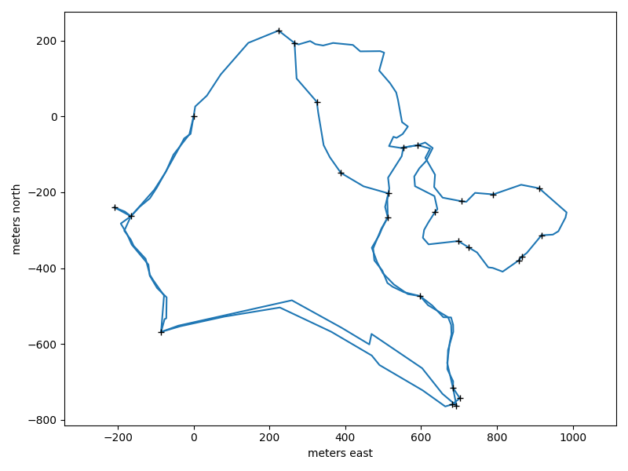

# hiking
Create maps of hiking paths, using pace counts and compass headings

## Usage

The notes taken while hiking should be of this form:
```text
# This is a comment
DECLINATION 0
PACES_PER_100METERS 60.0

# 3% error, on a good day
FRACTIONAL_ERROR 0.03

# DEGREES or MILS for compass headings
DEGREES

@start
000 30
@waypoint1
120 30
240 30
@start

SOLVE
```
Lines starting with `@` give a name to the point where you are standing.  Lines
containing two numbers give the compass bearing (with respect to magnetic north)
to the point you are about to walk to, and then the distance to that point in
paces.

Multiple SOLVE commands can be given, if you want to pace count some higher
accuracy waypoints and then have their locations not change later if further
lower accuracy pace counts are included.

To allow the code to correct for errors, hiking paths should contain loops,
where you revisit the same point at least twice.  Therefore, it is preferred to
have the `@start` waypoint show up at least twice in the list of waypoints.

Run the code with (for example):
```
python hiking.py data.txt --output data.png --figsize 8.5,11 --dpi 100
```

The resulting map can look something like this:


## To Do (maybe)
- [ ] Let decimal latitude and longitude to be added to a waypoint, if known
- [ ] Use a spherical Earth model to give lat/lon values to all points
- [ ] If multiple waypoints have lat/lon values, use those in the fitting process.
- [ ] Output result in gpx format, for input into www.openorienteering.org
  software, or other mapping software.

